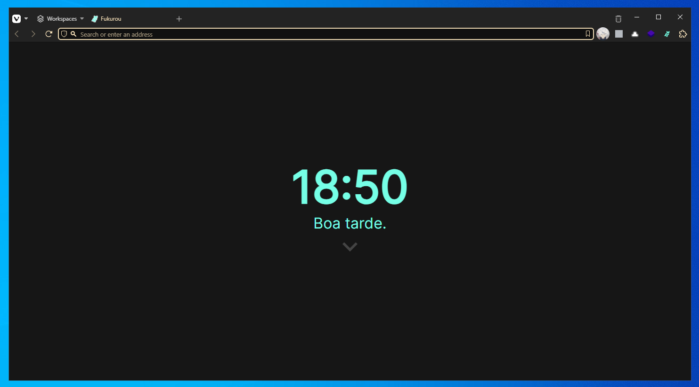
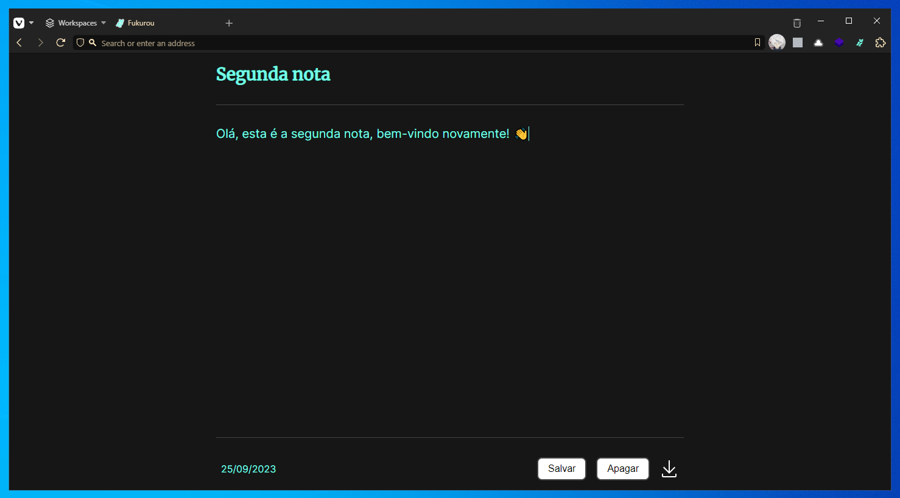
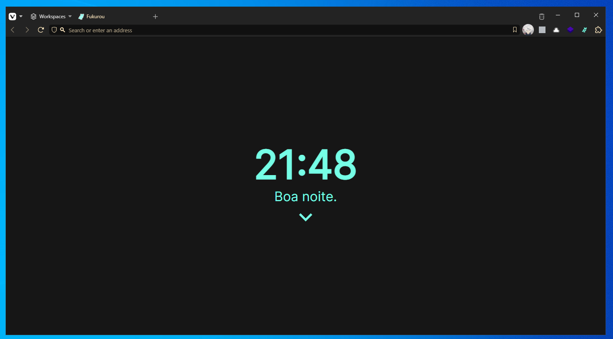
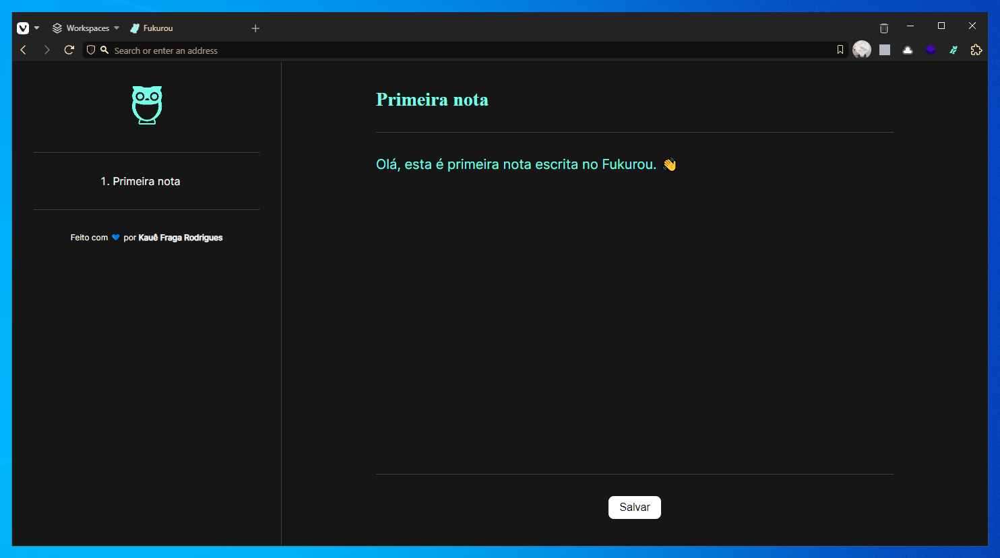
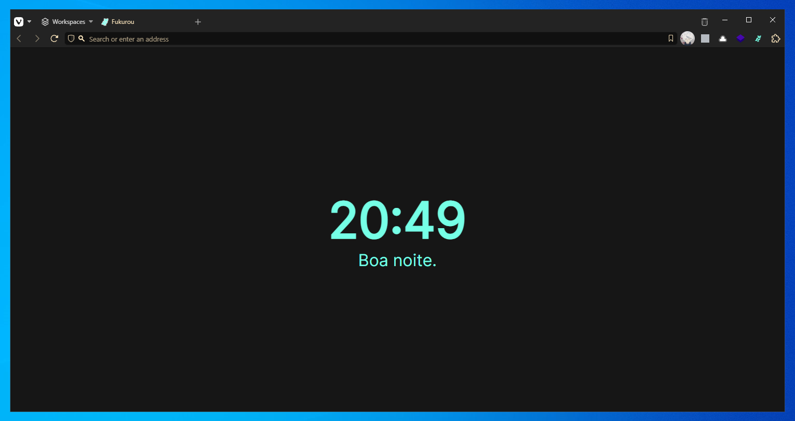
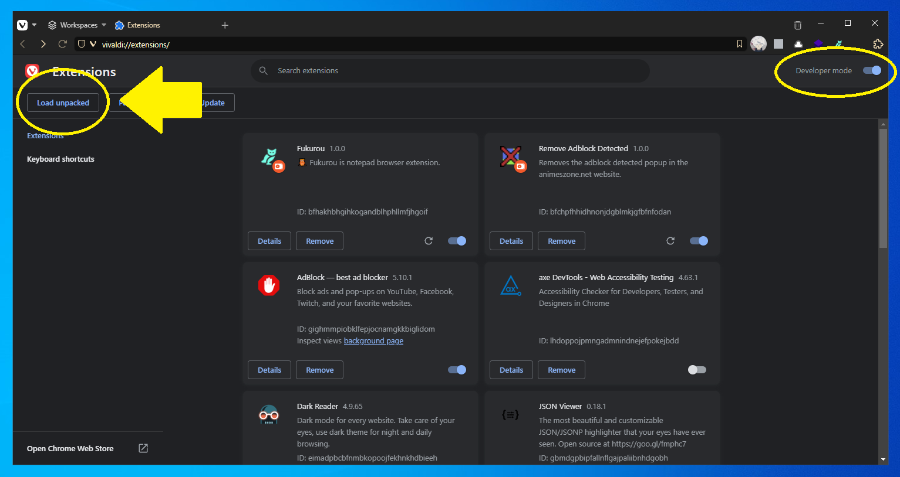

# `Fukurou` (:us:)

> 🦉 Fukurou is simple and lightweight notepad browser extension that overrides the `new page`.

### Features

- [x] A digital clock.
  - [x] Renders hours and minutes.
  - [x] Renders a greeting message.
- [x] A simple notepad
  - [x] Has title, text and created at.
  - [x] Save (local storage)
  - [x] Delete (local storage)
  - [x] Download
- [ ] A better notepad
  - [ ] Navigate through notes
  - [ ] Multiple notes
  - [ ] Create a note, delete a note...
  - [ ] Keyboard navigation
- [ ] Custom CSS
- [ ] I18n (currently, i will keep this extension only in Brazilian Portuguese)

## 🖼 Showcase

> Latest to the oldest.

Below you can see the latest release (1.1.0):

Some screenshots of the day 22/09/2023

   
  
  

First release (1.0.0)

   
  

## ⬇ How to install

1. Install the latest version of Fukurou at [the releases page](https://github.com/kauefraga/fukurou/releases) and unzip it somewhere
2. Open your browser (chromium-based) extension page
3. Enable the `Developer mode`
4. Click on the `Load unpacked` and select the folder where you have installed the Fukurou extension
5. Open a new tab, and done! 🎉

## 🧻 Resources and inspirations

A list of content and technologies that i read and applied to create this project:

- HTML, CSS and Javascript - The Best Mates.
- [Chrome manifest summary](https://developer.chrome.com/docs/extensions/mv3/manifest).
- [Inter font](https://fonts.google.com/specimen/Inter) - A simple font without serifs.
- [Merriweather font](https://fonts.google.com/specimen/Merriweather) - Another simple font but with serifs.
- [Icônes](https://icones.js.org) - Icon explorer, powered by Iconify.
  - Arrow down icon: `material-symbols:keyboard-arrow-down`
  - Download icon: `carbon:download`
  - Owl icon: `fluent-emoji-high-contrast:owl`
- [Shields Badges](https://shields.io/badges) - "Shields.io is a service for concise, consistent, and legible badges, which can easily be included in GitHub readmes or any other web page."
- [Proof of Concept | Fukurou (:brazil:)](https://github.com/kauefraga/poc-fukurou) - A prototype of the Fukurou extension.

## 📝 License

This project is licensed under the GPL-3.0 License - See the [LICENSE](https://github.com/kauefraga/fukurou/blob/main/LICENSE) for more information.
